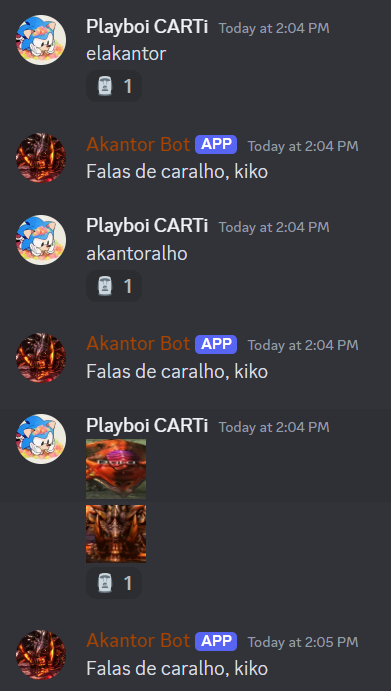

# "Falas de Caralho Kiko"

## Functionality

I want the bot to do complain with Kiko (specifically him) when he says anything containing "Akantor" or any variants:

## Design

Whenever someone sends a message, the bot will check if:
* It was *Kiko* (his username is on the file [kiko.properties](../../src/main/resources/kiko.properties), that way it's easy to change dynamically)
* He said anything containing:
  * "akantor";
  * "akantussy";
  * "akantorussy";
  * "akussy";
  * The emoji ":100000carts:"
  
  **Note:** This is case insensitive

## Implementation

This is the main section of code that this functionality uses.

```java 
/**
 * Everytime someone sends a message, this is checked
 * @param event message content
 */
@Override
public void onMessageReceived(@NotNull MessageReceivedEvent event){
    if(event.getAuthor().getName().equalsIgnoreCase(KIKO_USERNAME) && Utils.containsAny(event.getMessage().getContentDisplay(), VARIACOESDEAKANTOR)){
        event.getChannel().sendMessage("Falas de caralho, kiko").queue();
        event.getMessage().addReaction(Emoji.fromUnicode("U+1F5FF")).queue();
    }
}
```

## Demonstration

### Result

