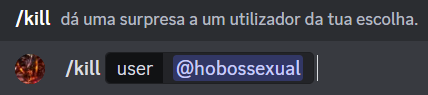
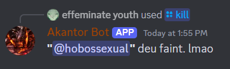
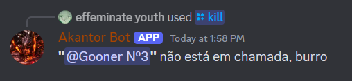

# Kill a Member

## Functionality

I want the bot to do all the following things to a user of my choice if they're on a call: 
* **Server Mute** the user;
* **Server Deafen** the user;
* **Kick** the user from the call.

## Design

A new **Slash Command** was added, called "kill".

This command accepts a user as a parameter.

## Implementation

This is the main section of code that this functionality uses.

```java 
/**
* Server Mutes and Server Deafens a user, as well as removing them from the call
* @param event
*/
public static void killAMember(@NotNull SlashCommandInteractionEvent event){
    event.getGuild().retrieveMemberById(event.getOption("user").getAsUser().getId()).queue(user -> {
            if(user.getVoiceState().inAudioChannel()) {
                user.mute(true).queue();
                user.deafen(true).queue();
                user.getGuild().kickVoiceMember(user).queue();
                event.reply(String.format("**\"%s\"** deu faint. lmao", user.getAsMention())).queue();
            } else {
                event.reply(String.format("**\"%s\"** não está em chamada, burro", user.getAsMention())).queue();
            }
         }
    );
}
```

## Demonstration

### Prompt



### Result if user is in call



### Result if user is not in call

