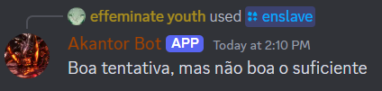

# Remove a user's roles

## Functionality

I want the bot to do remove all of a user's roles.

**Note 1:** User can't do this if they don't have roles.

**Note 2:** User can't do this to the bot itself

## Design

A new **Slash Command** was added, called "enslave".

This command accepts a user as a parameter.

## Implementation

This is the main section of code that this functionality uses.

```java 
/**
 * Removes all of a user's roles
 * @param event
 */
public static void removeAMembersRoles(@NotNull SlashCommandInteractionEvent event){
        try{
            event.getGuild().retrieveMemberById(event.getOption("user").getAsUser().getId()).queue(user -> {
                    List<Role> roles = user.getRoles();
                    if (event.getMember().getRoles().isEmpty())
                        event.reply(String.format("Não tens permissões para fazer essa ação seu cromo %s",Emoji.fromUnicode("U+1F5FF"))).queue();
                        // Action can't be performed if sender doesn't have roles
                    else if (!roles.isEmpty()) {
                        for (Role role : roles) user.getGuild().removeRoleFromMember(user, role).queue();
                        event.reply(String.format("Diz adeus às tuas roles meu querido amigo %s", user.getAsMention())).queue();
                    } else event.reply(String.format("O %s já nem roles tem e tu ainda fazes isso? Que rude", user.getAsMention())).queue();
                }
        );
    } catch (HierarchyException e){
        event.reply("Boa tentativa, mas não boa o suficiente").queue();
    }
}
```

## Demonstration

### Prompt


### Result if it goes well


### Result if target is bot



### Result if user doesn't have roles


### Result if target didn't have roles beforehand

