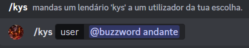
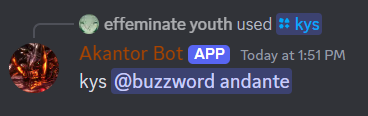

# Send *Kys*

## Functionality

I just want the bot to send a simple *Kys* to a user of my choice.

## Design

A new **Slash Command** was added, called "kys".

This command accepts a user as a parameter.

## Implementation

This is the main section of code that this functionality uses.

```java 
/**
* Sends "kys" to a chosen user
* @param event
*/
public static void sendKys(@NotNull SlashCommandInteractionEvent event){
    event.getGuild().retrieveMemberById(event.getOption("user").getAsUser().getId()).queue(user ->
            event.reply("kys " + user.getAsMention()).queue()
    );
}
```

## Demonstration

### Prompt



### Result

